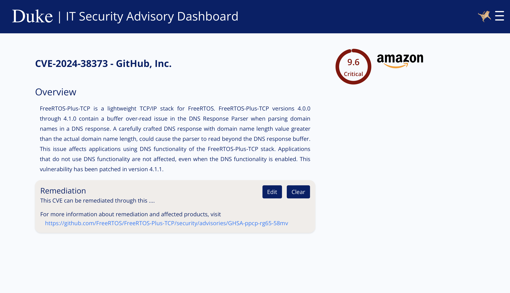

# Security Advisory System


## 👋 Introduction
This project is a React-based web application designed to assist Duke IT professionals in managing security advisories and remediation information. The application includes user authentication and profile management, leveraging a context for user profile data. It features a responsive interface with routing handled by react-router-dom, providing various pages such as Home, About, Settings, and detailed CVE information. The Table component offers paginated and sortable views of CVE data, with filters and dynamic sidebar functionality. The application integrates with backend services for data fetching and user authentication, ensuring a seamless and secure user experience. The UI is enhanced with custom CSS for a polished and professional look, making it intuitive for IT professionals to navigate and use.


## 👩 User functionality
### 💻 Homepage
The Home component of a React application serves as the main dashboard for Duke's database of open-source vulnerabilities and cloud misconfigurations. It features two graphical representations: a bar graph depicting the number of CVEs for different CVSS scores and a dot plot illustrating CVEs for CVSS and EPSS scores.
The component dynamically fetches and displays the top vulnerabilities of the past month, updating every 5 seconds. Each vulnerability is showcased in a card format with a title, summary, CVSS base score, and a link to learn more. Users can view all vulnerabilities by clicking the "View all" link.

 {: width="100px"}

### 📊 Vulnerabilities Table
The Table component in this React application displays a paginated and sortable table of recent CVEs. It includes a sidebar for filtering vulnerabilities by severity, date range, search query, and vendors. Users can refresh the data and view details of each CVE by clicking on its ID. The component utilizes React Table for sorting and pagination and dynamically fetches data from an API endpoint. The layout and style are managed with styled-components and CSS, ensuring a responsive and user-friendly interface.

 {: width="100px"}

### 📄 CVE Details Page

This React component, CVEpage, fetches and displays detailed information about a specific CVE (Common Vulnerabilities and Exposures) identified by its cveId. It includes an overview, remediation details, and vendor information. The component fetches data from various endpoints and handles both display and editing of remediation information, allowing users to update or clear this data. It also features a textbox for editing remediation information and displays a circular progress indicator for the CVSS base score. Error handling and loading states are managed within the component to ensure a smooth user experience.

 {: width="100px"}

### ✅ Vendor Selection

The Vendors Section component in React manages the selection of vendors for a user. It fetches the list of available vendors and the user's current vendors from an API, storing them in state. Users can check or uncheck vendors to add or remove them from their list, with the changes reflected in the backend via API requests. The component renders available vendors with checkboxes and user vendors using a Vendors component. Vendor logos are displayed next to their names for better visualization. The component handles errors gracefully and provides a clean interface for managing vendor selections.

 {: width="100px"}

### 🔊 Security Alerts
The SecurityAlerts component in React provides a user interface for managing email notification preferences related to security alerts from various vendors. It includes several features:

- Vendor Management: Users can add and remove vendors from their notification list. When adding a vendor, the component ensures that duplicates are not added.

- Frequency and Severity Settings: Users can set how frequently they receive notifications (daily, weekly, etc.) and the severity level of the alerts (none, all, medium, high, critical).

- Data Fetching and State Management: The component fetches the list of vendors and user-specific notification settings from an API and manages these data within the state.

- Unsubscribe Option: Users have the option to unsubscribe from all notifications, which deletes their frequency and severity settings as well as all vendor notifications.

- Form Handling: A form is shown to add new vendors, and there is handling for duplicate vendor warnings and form cancellation.
This setup allows for a dynamic and user-friendly way to manage security alert notifications efficiently.

 {: width="100px"}

# 💻 Tech Stack
- Database: **PostgreSQL**
- Data visualization: **PGAdmin**
- Backend: **Ruby on Rails**
- Frontend: **ReactJS**

### APIs
- **CVEDetails**: used to get CVE IDs, summary, CVSS and EPSS scores and remediation information.
- **KEVCatalog**: CVE IDs, summary, CVSS and EPSS scores and remediation information. Used KEV catalog to have more vendors other than those on the CVE Details page.


## 👩🏻‍🏫 Application Architecture


## Installation
We have Dockerfiles set up for both the frontend (React) and backend (Rails) directories. These are independent applications that are managed together using Docker Compose.

To build and start the project, run the following commands in the root directory:
`docker-compose build`
`docker-compose up`
This will install all necessary dependencies and start the project.

Once the containers are up and running, you can access the react application in your browser at http://localhost:3000
Provide the app with credentials to access the database and other external systems. The .env file should include the following variables:
```
POSTGRES_USER
POSTGRES_PASSWORD
POSTGRES_DB
POSTGRES_HOST
RAILS_ENV
CVEDETAILS_TOKEN
BACKEND_URL
```


## Future Development
- Integration of User Authorization to only permit certain groups to configure remediation messages.
- Add a list of effected products for each Vulnerbility
- Create mobile interface
- Support more sources of Data beyong CVE Details and CISA KEV catalog

## Contributing
We welcome contributions! Please follow these steps:

Fork the repository.
Create a new branch (`git checkout -b feature-branch`).
Make your changes.
Submit a pull request.

## Authors and acknowledgment
- Kelly Shahu - Initial Work - 
- William Chen - Initial Work - WilliamChenn
- Brian Kim - Initial Work - 
- Katherine Yu - Initial Work - 
- Ananya Agrawal - Initial Work - 
- Duke University IT Security Office

## License
For open source projects, say how it is licensed.

## Project status
Active development. We are continuously adding new features and improving the application. If you are interested in contributing, please contact us!
